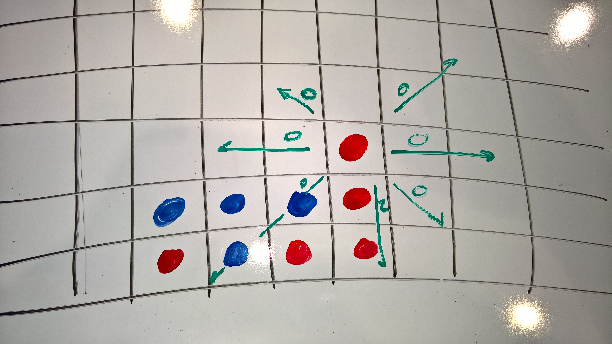

Hardware and Code 
=================
When you get to the point where you 
are dealing with both hardware *and* code, 
you're really about to unleash some great 
fun and learning.  

* Understanding how physical design might
  affect the code you write
* Learning about libraries that can be 
  used to make coding easier

Key Goals
---------

Options
-------
.. _hwcodeOptions:

The following table offers some simple 
comparisons of the different platforms....

.. list-table:: Comparison
   :widths: 20 10 10 15 20 
   :header-rows: 1
   :class: tight-table

   * - Platform
     - Self-Contained?
     - Cost
     - Flexibility
     - Description
   * - Raspberry Pi
     - No
     - $30 
     - Limitless
     - Mini computer board with GPIO pins for interfacing and experimentation.
   * - Lego Mindstorms
     - Yes
     - $350
     - Medium
     - Lego robotics sytem with motors and sensors.  Build a robot, then write logic to move it around and do stuff.

Raspbery Pi (Family)
~~~~~~~~~~~~~~~~~~~~
Here's what a Raspberry Pi 2 and
a Sense HAT look like:

.. image:: /images/PiAndSenseHAT.jpg

With these, you can do cool things
like program your own version 
of Connect-4 -- you will need to 
consider how to check for a 
win by evaluating options as shown
in the diagram below:

Lego Mindstorms
~~~~~~~~~~~~~~~
